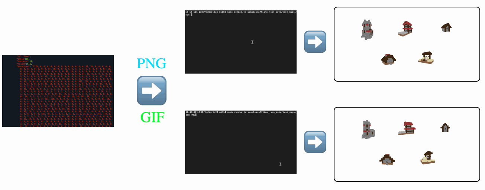
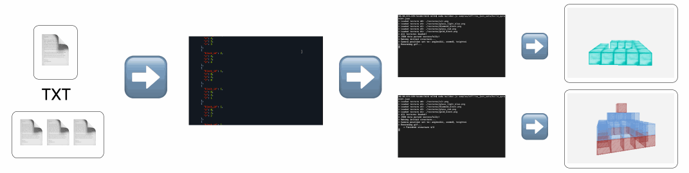
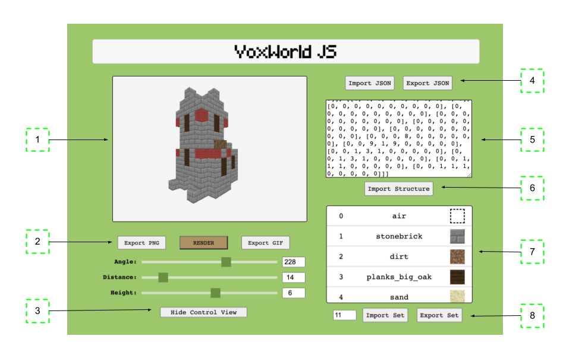
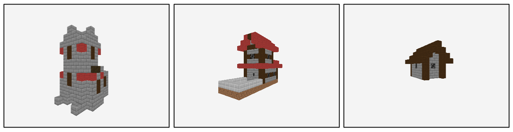
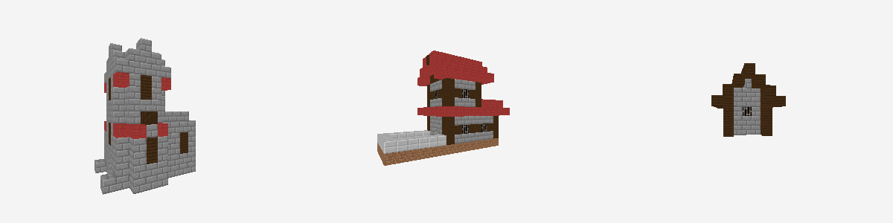
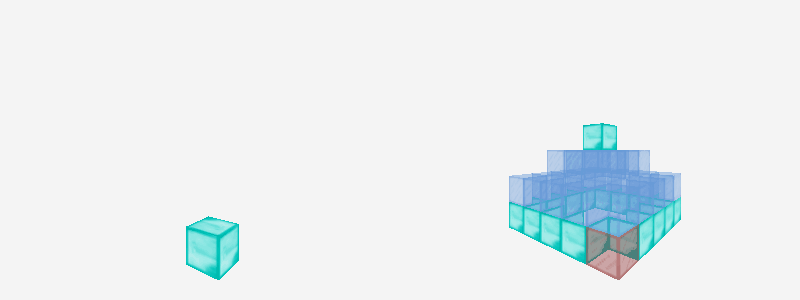
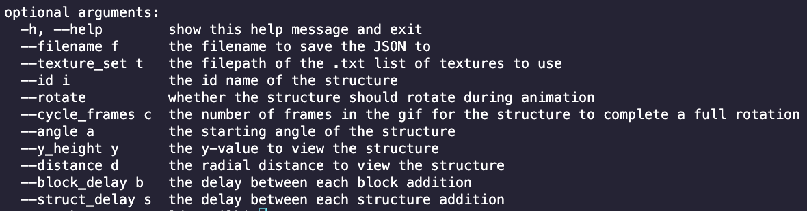

# [VoxWorldJS](https://mastermilkx.github.io/VoxWorldJS/)
Quick voxel renderer application for viewing textured 3d integer arrays 

**Quick Online Interactive Webapp**:  [https://mastermilkx.github.io/VoxWorldJS/](https://mastermilkx.github.io/VoxWorldJS/)

## Table of Contents

1. [System Demos](#1-system-demos)
2. [Browser Usage](#2-browser-usage)
3. [Mass Output Usage](#3-mass-output-usage)
4. [Builder Output Usage](#4-builder-output-usage)
5. [Helper Scripts](#5-helper-scripts)
6. [Notes](#6-notes)

--- 

## 1. System Demos
- **Browser system** - for quick interactive viewing of a 3d integer array

- **Mass Render Console system** - for mass rendering and image exporting of multiple 3d integer arrays structures.

- **Builder Console system** - for creating gifs of structures being built block by block.



---


## Requirements
*Browser system*
* Web-browser (preferably Google Chrome)
* Python3's HTTPServer module (or any quick localhost server you prefer)

*Console system*
* NodeJS

## Installation

1. Download and install the package manager [NodeJS](https://nodejs.org/en/download/)
2. Clone this repository to your local machine and navigate to it using a terminal
3. _(For console usage only)_ Run the command `npm install` to install the necessary packages found in the [package.json](./package.json) file

* _Note_: If node-canvas errors out do this 
    1. goto `node-modules/canvas/`
    2. run `npm install --build-from-source`
---


## 2. Browser Usage

### Running
1. Start a local server in the directory using the command `python -m http.server`
2. In a browser, open the localhost webaddress specified by the server
   - For python's http.server, it will most likely be at [http://[::]:8000/](http://[::]:8000/) 
3. The diagram below shows the different features of the web app
   
    1. __Render Canvas__ - displays the current point of view of voxel structure with the texture rendering
      
    2.  __Render Toolbar__ - rendering tools; 
        * [RENDER] - re-renders the current screen (use if a new structure was imported or a texture was changed)
        * [Export PNG] - download the current rendering as a PNG file
        * [Export GIF] - download the current rendering as a GIF with the camera completing a full rotation around the structure
  

    3. __Control View__ - toggle to show or hide camera controls
        * [ANGLE] - Adjust the angle the camera views the structure at (0-360)
        * [DISTANCE] - Adjust the proximity the camera is to the structure (1 = closer, 100 = farther)
        * [HEIGHT] - Adjust the center point y-value to view the structure (-64-64 with 0 = origin/ground level)
  
    4. __JSON Import/Export__ - exports the current structure data and texture ordering data together as a readable JSON file or imports it back into the app for easy access. _See the [full_json_sets](samples/full_json_sets/) folder for sample files you can import_
   
    5. __Raw Structure Text Input__ - allows for direct text input of the structure's 3-dimensional integer array (in [X,Y,Z] format). _For help with converting a 3d numpy array to readable JSON format try using the [npy2txt](scripts/npy2txt.py) file._

    6. __3D Structure .txt file Import__ - import a raw .txt file of the 3-dimensional integer structure. _See the [txt_houses](samples/txt_houses/) folder for sample files you can import_
    7. __Texture ID Assignment__ - assigns a texture image to an index value represented in the input 3d structure array. 
       * [ID] - Left-most column. Index value associated with the block in the 3d array
       * [Texture Name] - Middle column. Textures can be reassigned by clicking the texture name and choosing another name from the dropdown. 
       * [Texture Preview] - Right-most column. Shows how the texture will be rendered in the viewing canvas.
        * _For help with changing the available textures to select from, see the 'Modifying' section below_
    8. __Texture List Controls__  - change the number of textures avaialbe for each index value. Exports the current texture list and index association as a plaintext file (with the texture name on each line) or imports it back into the app for easy access. _See the [texture_preset_files](samples/texture_preset_files/) folder for sample files you can import_
 
### Modifying
* **To change the texture set used:** (Note: can only be done on a local version of the app) Replace the texture images in the [textures/](textures/) folder and run the script [texture_dir_json.py](scripts/texture_dir_json.py) (see the 'Helper Scripts' section for more details). It's recommended to keep the "air.png" texture in this set to have blocks that are not rendered as cube objects.

--- 
## 3. Mass Output Usage

### Input
1. JSON Files must be structured like this:
```
{
    "structure_set":[
        {
            "structure": <STR of INT 3D ARR>,

            "id":<STR>,
            "angle":<INT>,
            "distance":<INT>,
            "height":<DOUBLE>,
            "texture_set": <STR LIST>
        },
        {...}
    ]
}
```
The `structure` is the only mandatory value as a stringified 3d integer array (see the [npy2txt.py](scripts/npy2txt.py)) - all others are optional. However, if no `texture_set` is specified in the first listed structure, the default set will be used, as specified in the [config](config.yaml).

### Running
1. Run the command `node mass_render.js [INPUT JSON FILE] ([PNG|GIF] [OUTPUT_DIR])` 
   - `[INPUT JSON FILE]` - the name of the file with the list fo structures and other parameters you want to process 
   - `[PNG]` or `[GIF]` - (optional) specifies which kind of output you'd lke
   - `[OUTPUT_DIR]` - (optional) the output directory you'd like to store the exported media to (creates the directory if it doesn't exist)
   - _Example_: `node mass_render.js samples/offline_json_sets/render_png-gif_maps.json GIF my_dir/`  renders the structures to GIFs and store in a folder named my_dir`

* Note: _See the [offline_json_sets](samples/offline_json_sets) folder for sample files you can import_

### Modifying
The parameters can be modified in the [config.yaml](config.yaml) file. Descriptions and default values for these parameters can be seen in the comments of the file.

### Sample Outputs
PNG

GIF


---
## 4. Builder Output Usage

### Input
1. Requires a special type of JSON made by the [builder_anim.py](scripts/builder_anim.py) script. See its subsection below in the 'Helper Scripts' section below.

### Running
1. Run the command `node builder.js [INPUT JSON FILE]` 
   - `[INPUT JSON FILE]` - the name of the file with the initial structures, list of block change actions and other parameters you want to process 
   - _Example_: `node mass_render.js samples/offline_json_sets/build_pyramid1.json GIF my_dir/`  renders and animates the structure and store in a folder named my_dir`

* Note: _See the [offline_json_sets](samples/offline_json_sets) folder for sample files you can import_

### Modifying
The parameters are stored in the JSON file itself (see the 'Options' description of the [builder_anim.py](scripts/builder_anim.py) documentation below.)

### Sample Outputs
(LEFT) 1 pyramid build from nothing (RIGHT) 3 pyramids built by modifying the blocks



---
## 5. Helper Scripts
There are 3 scripts that can assist with converting your code for use with the system

### [npy2txt.py](scripts/npy2txt.py)
Converts a numpy .npy array to a JSON readable text string.

##### _Console Usage_: 
* `python3 npy2json.py [NPY FILE INPUT] ([TXT FILE OUTPUT])`
  - `[NPY FILE INPUT]` - the .npy file
  - `[TXT FILE OUTPUT]` - (optional) alternative name for the output txt file of the 3d array string - if not specified, the name will be the same as the input
##### _Python Inline Usage_: 
    ```
        import numpy as np
        from scripts.npy2txt import npy2txt

        a = np.random.randint(0, 10, size=(3, 4, 5)) #random 3d array
        print(npy2txt(a))   
        #should print something like: '[[[5, 6, 1, 6, 4], [0, 0, 0, 4, 8], [0, 0, 2, 7, 1], [9, 3, 3, 2, 3]], [[4, 9, 6, 4, 2], ...., [4, 0, 3, 4, 8]]]'
    ```

_Note_: If your structures come out rotated weird, try using [np.rot90()](https://numpy.org/doc/stable/reference/generated/numpy.rot90.html) and rendering it until it looks correct.


### [texture_dir_json.py](scripts/texture_dir_json.py)
Generates a JSON of the texture names in a directory to be read and used by the app for importing the texture images.
*  `python texture_dir_json.py ([PATH TO TEXTURE DIRECTORY]) ([PATH TO OUTPUT JSON FILE])`
    - `[PATH TO TEXTURE DIRECTORY]` - (optional - default='textures/') the path to the folder containing the list of texture images you'd like to use
    - `[PATH TO OUTPUT JSON FILE]` - (optional) the pathname for the output JSON file to export as

### [builder_anim.py](scripts/builder_anim.py)
Generates a JSON for an integer 3d array structure txt file that builds the structure from scratch by adding blocks iteratively OR takes in a set of 3d array txt files to transform from one structure to another by switching out blocks.
* `python builder_anim.py [PATH TO TXT STRUCTURE FILE] ([PATHS TO OTHER TXT STRUCTURE FILES]) ([OPTIONS])`
    - `[PATH TO TXT STRUCTURE FILE]` - the path to the txt file of the 3d integer array representing the structure to render. Having only one structure will make the script build the structure from nothing.
    - `([PATHS TO OTHER TXT STRUCTURE FILES])` - (optional) the path(s) to other 3d integer array structures to transform into one after the other (NOTE: must be the same dimensions as the first passed structure)
    - `(options)` - (optional) additional parameters to pass to the JSON file to be read in when the animation is parsed by the [builder.js](builder.js) script. They are as follows:
  - 

---
## 6. Notes
- License: MIT
- If you have any questions, feel free to contact me via email at mlc761@nyu.edu or DM me @MasterMilkX on Twitter.
- If you use this in a project (for school, research, or fun), please reach out! I'd love to see how you use it 😉!
- This project was made for research purposes only - particularly for myself and my lab mates at the Game Innovation Lab at NYU. I do not own the texture images - those are really from Minecraft (version 1.12)
